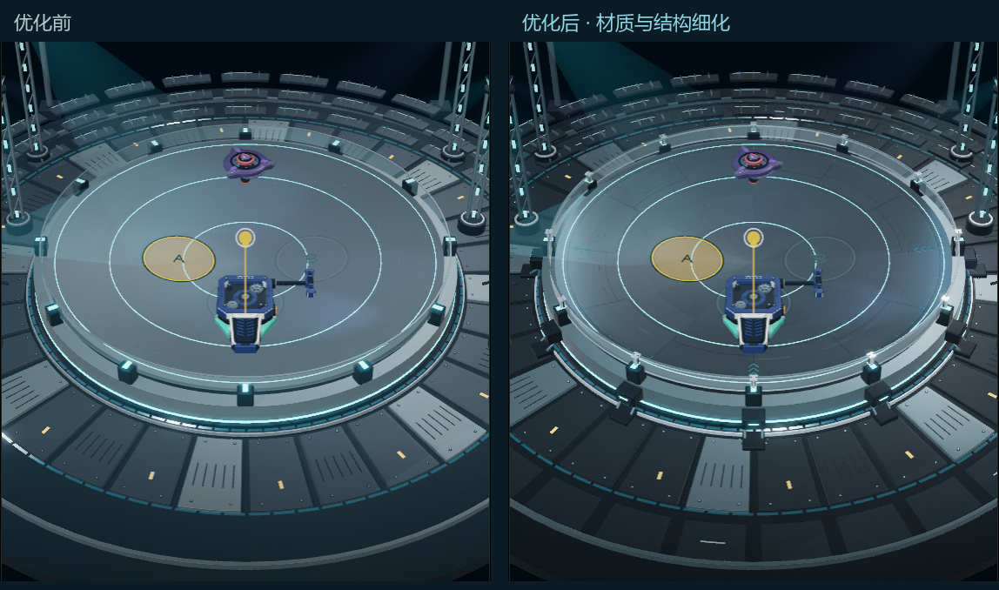

# 冠军竞技场材质与结构细化

2026-09-23 · Web 原型 · 本轮提供的冠军竞技场概念图

## 已完成

- 六类物理材质：缎面钛色盘、石墨漆甲板、深色机壳、拉丝铝、抛光铝和透明亚克力。修正 Physical 着色定义，并显式绑定日夜环境反射。
- 盘面细磨纹、浅六角蚀刻、外围接缝与轻微擦痕；石墨涂层颗粒、金属亮边；护圈随视角变化的透明度和分段边缘。
- Blender 同步补充十二组护圈压条、密封垫、锁扣螺钉、十二组侧面检修盒及斜撑、外圈底座盖板/凹槽、盘面刻度和箭头。源文件和 GLB 已重建。
- 两处侧向面光提供宽反光，保留六路扫光和两圈跑灯。没有新增阴影贴图、环境探针、实时反射或折射目标。
- 半径 `6.9`、原有场景比例、A/B/C 供能区、碰撞、物理求解器、经济和装备数据未因本轮美术修改。

## 画面对照



以下均为当前实际发射准备界面，使用隔离存档。桌面视口为 1440×1000，游戏保持 564×1000 竖屏；手机视口为 390×844。

| 时段 | 优化前 | 优化后 |
| --- | --- | --- |
| 夜晚桌面 | [截图](before/metal-night-desktop.png) | [截图](after/metal-night-desktop.png) |
| 夜晚手机 | [截图](before/metal-night-mobile.png) | [截图](after/metal-night-mobile.png) |
| 白天桌面 | [截图](before/metal-day-desktop.png) | [截图](after/metal-day-desktop.png) |
| 白天手机 | [截图](before/metal-day-mobile.png) | [截图](after/metal-day-mobile.png) |

首轮检查发现盘面分段线过重、夜景中心偏灰，集中调整了刻线强度、反射比例和侧向面光。最终检查确认护圈仍通透，A/B/C 标记可辨，窄屏没有新增横向溢出。移动灯光相位随实际运行变化，前后图用于材质/结构对照，不作逐像素回归基准。

## 验证结果

以下表格保留美术交付当次结果。后续已修复过时的碰撞诊断测试，全量 **31/31 通过**，详见 [单测跟进记录](test-followup.md)。

| 检查 | 结果与证据 |
| --- | --- |
| `npm run build` | 通过；保留 Three 主包大于 500 kB 的构建提示，见 [日志](build.log) |
| `npm test` | **28 通过、1 失败**，见下方限制及 [日志](tests.log) |
| `npm run verify:worlds` | 31 项通过，见 [日志](worlds.log) |
| `npm run verify:championship` | 30 项通过，见 [JSON](championship/verification.json) |
| `npm run verify:loading` | 17 项通过，见 [JSON](loading/verification.json) |
| `npm run verify:gpu` | 21 项通过，见 [JSON](gpu/verification.json) |
| 设计扫描 | 0 个主要问题、6 个材质配色提示；已将对应表面颜色登记到 DESIGN.md，[原始扫描](design-scan.json) |
| 改动格式检查 | `git diff --check` 通过 |

当次单测失败在 `tests/battle-simulation.test.js:99`：诊断碰撞用例期待 `tiltDelta > 0`，实际为 `-0.046875`。该用例仅导入 core/data 模块，涉及工作区中另一路物理实现变更；美术交付当时只修改场景美术及其检查工具，未修改物理模块或该断言，因此当次未将全量单测标记为全绿。

## 实际渲染与资源

隔离的 282×500 像素测量保持相机、几何与时间一致，分别关闭对应渲染因素：

- 环境反射：71,501 个像素变化，RGB 三通道绝对差之和大于 15。
- 两处侧向面光：2,455 个像素变化，同一阈值。
- 六路真实聚光：9,196 个像素变化，三通道差之和大于 3。测试时隐藏了可见光锥，因此不是只比较装饰光束。
- 法线磨纹/浅刻痕：210 个像素变化，三通道差之和大于 3。
- 跑灯与扫光运动：847 个像素变化，三通道差之和大于 15。

细磨纹与缎面照明比旧高亮灯效更细微，原统一阈值 15 不适合该测量；记录保留了完整分档数据，未增加材质亮度来满足测试。磨纹总计 3,513 个非零变化像素，最大三通道差 9；聚光总计 25,695 个非零变化像素，2,915 个超过 6、5 个超过 15。详情见 [测量原始值](championship/measurements.json)。

六类表面均验证 Physical 定义；所有材质在切换白天后绑定当前环境。暂停、页面隐藏、减少动态效果和日间降光通过；两次往返标准场后的几何/纹理数量稳定，局部灯光和材质正确释放。

模型由 6,657,520 增至 8,662,724 字节；最终为 13 个网格/材质、341,540 个三角形、0 张外部贴图。实际发射准备界面的整帧统计夜间约 164 次提交、910,540 个三角形，包含阴影与后处理重复提交；不是单份模型面数。新增结构有实际体积和面数成本。

隔离场景的 45 帧诊断中，调用 GPU `finish()` 后的绘制时间中位数约 0.9 ms，P95 约 1.2 ms。这是本机桌面 Chrome 的轻量场景测量，不包含完整游戏逻辑，也不能作为真实手机帧率认证。

完整游戏另执行一轮 `measure:gpu`（Chrome 153.0.8010.53、CPU 1×、关闭 GPU 磁盘着色缓存，支持并行编译）：

| 阶段 | 发起至可见 |
| --- | --- |
| 冠军场首次进入 | 654 ms |
| 阅读等待预热后进入冠军比赛 | 42 ms |
| 返回冠军地图 | 48 ms |
| 陈列室首次进入 | 909 ms |
| 街头首次进入 | 1,319 ms |

冠军预热开战满足本机本次 `<100 ms` 目标。街头首进仍超过 `<1.1 s` 目标，本轮未修改街头加载实现；此为单次测量，不代表所有设备或网络。完整数值、阶段事件和调用统计见 [性能记录](performance/after.json)，浏览器错误为空。

## 复现

在已启动 `http://127.0.0.1:5173` 的情况下，从 `web-prototype/` 运行：

```powershell
$env:WORLD_CAPTURE_DIR='../.impeccable/review/championship-materials'
node tools/capture-world-materials.mjs after metal
$env:QA_OUTPUT_DIR='../.impeccable/review/championship-materials/championship'
npm run verify:championship
```

模型从根目录运行 `tools/build_championship_scene.py` 重建。着色实现在
`web-prototype/src/render/championship-atmosphere.js` 与 `world-surface.js`。
Godot 尚未迁移；此交付为风格化实时场景的材质与细节完善。
