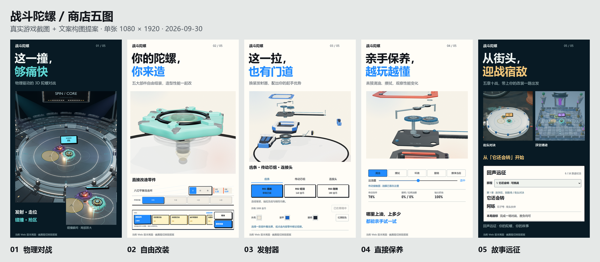

# 《战斗陀螺》商店五图设计提案

2026-09-30。基于当前 Web 原型，已采集真实界面并完成五张文案与构图预览。
本目录是商店素材提案，不是游戏界面改版，也不是已适配某个商店的上架包。



## 核心安排

按 **对战爽感 → 自由改装 → 发射器深度 → 动手保养 → 故事远征** 排列。
前两张先回答“这是什么游戏”“我能怎么玩”；第三、四张展示本作有辨识度的
机械与动手乐趣；最后一张给出持续游玩的理由。每张只立一个核心卖点。

受众是喜欢陀螺、模型改装、机械结构及短局对战的玩家。封面延续已确认的
“让童年的陀螺再战一场”方向，画面本身优先说明玩法。

## 五图文案与构图

| 顺序 | 主标题 | 副文案 | 画面组织与证据 |
| --- | --- | --- | --- |
| 01 | **这一撞，够痛快** | 物理驱动的 3D 陀螺对战 | 冠军竞技场占主要画幅，青绿与紫色陀螺发生碰撞；右下放同一帧的碰撞局部，明确标注“局部放大”。保留真实冲击光与加速区。 |
| 02 | **你的陀螺，你来造** | 五大部件自由组装，造型性能一起改 | 用选中攻击环的实际模型大图建立主视觉；下方放真实 DIY 形变工具和材料选项。模型为当前基础配置，无新增零件。 |
| 03 | **这一拉，也有门道** | 换装发射器，配出你的起手优势 | 放大蓝白发射器的爆炸结构，保留齿条、齿轮和连接头；下方展示三个性能槽位及实际换装、配色控件。 |
| 04 | **亲手保养，越玩越懂** | 直接滴油、擦拭，观察性能变化 | 使用传动部位近景，配合实际滴油后的提示、出油量与保养读数。表现可自由试验的触感；不把“上油”表述为无条件增强。 |
| 05 | **从街头，迎战宿敌** | 五章十战，带上你的改装一路出发 | 街头与浮空遗迹两张战斗画面并列，下方放“回声远征”的真实首个任务。场景差异负责吸引注意，任务卡负责说明存在故事内容。 |

## 统一视觉

- 单张 **1080 × 1920，9:16**；这是本次设计母版尺寸，最终按目标商店另行导出。
- 顶部为游戏名、两行短标题和一句副文案；主标题在缩略图中仍能读懂。
- 第 1、5 张采用既有深蓝赛场色；第 2—4 张采用既有纸白、黑字、电光蓝。
  统一字体和版心，以场景本身区分内容。
- 主体使用游戏截图裁切放大；下方仅保留证明卖点的实际操作或任务片段。
  避免整屏小字和多层手机外框争夺注意力。
- 字体沿用项目的微软雅黑体系；导出 PNG 不附带字体文件。
- 每张底部标注“当前 Web 版本画面 · 截图裁切排版提案”，用于区分预览与上架定稿。

## 查看与下载

| 图 | 排版预览 | 当前版本原始截图 |
| --- | --- | --- |
| 01 | [对战](posters/01-battle.png) | [碰撞瞬间](raw/01-battle.png)、[发射准备](raw/01-launch.png) |
| 02 | [陀螺改装](posters/02-assembly.png) | [攻击环选择](raw/02-assembly.png)、[DIY 编辑](raw/02-diy.png)、[整机](raw/02-assembly-overview.png) |
| 03 | [发射器](posters/03-launcher.png) | [蓝白结构](raw/03-launcher.png)、[红黑配色](raw/03-launcher-red.png) |
| 04 | [保养](posters/04-maintenance.png) | [滴油反馈](raw/04-maintenance.png)、[对照试拉](raw/04-maintenance-trial.png) |
| 05 | [故事远征](posters/05-journey.png) | [街头战斗](raw/05-street.png)、[遗迹战斗](raw/05-ruins.png)、[任务](raw/05-journey.png)、[剧情展开](raw/05-journey-story.png)、[选场](raw/05-worlds.png) |

## 画面来源与边界

14 张原始 PNG 均来自 2026-09-30 本机 Chrome 中运行的当前 Web 版本，
页面来源为 `http://127.0.0.1:5173/`。CSS 视口为 540 × 960、DPR 为 2，
输出为 1080 × 1920。这是桌面浏览器对竖版游戏的截图，不是手机真机验收。

截图使用一次性浏览器上下文，只跳过教学并给截图存档设置 1000 金币，
沿用现有基础装备、正式价格与所有权逻辑；未读取或改动用户的日常存档。
红黑配色和滴油通过真实界面操作，均为未保存草稿。

首图是在求解器自然产生陀螺碰撞后约 65ms 定格动画时钟；
街头、遗迹在开战约 0.85 秒定格。没有摆放假的碰撞、改写物理、添加特效或替换模型。
原图不修改像素；排版预览仅进行裁切、等比缩放、拼版与文字叠加。
局部放大是同一截图的细节，不表示游戏中另有放大窗口。

“五章十战”、三槽发射器、五件式陀螺及保养能力依据当前 Web 内容。
本套文案不把公网多人、手机传感器或工程级仿真当作已经交付的卖点。
场景采用现有可进入的地图；第 5 张并列的街头、遗迹战斗图用于展示场景，
不表示它们属于同一场战斗或同一张任务界面。

## 检查与复用

截图采集过程的页面异常记录均为空。已检查五张主图及总览的内容、字形、
裁切和尺寸；没有修改游戏源文件，因此未额外运行游戏构建或完整回归。

`capture-manifest.json`、`worlds-manifest.json` 保存采集状态；
`composition.json` 记录每个裁切区域与原图 SHA-256，方便追溯。
所有排版 PNG 内嵌来源与拼版说明。

在项目根目录、开发服务器已启动的情况下，可重新采集和排版：

```powershell
node docs/store-five/2026-09-30/capture.mjs
node docs/store-five/2026-09-30/capture.mjs --worlds-only
python docs/store-five/2026-09-30/compose.py
```

正式定稿前只需确定目标商店及其尺寸、裁切安全区；本次提案不改动现有游戏视觉规范。
